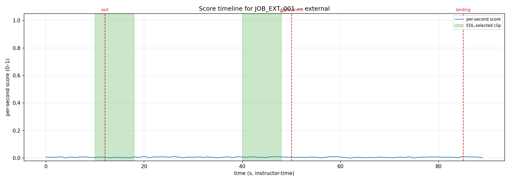
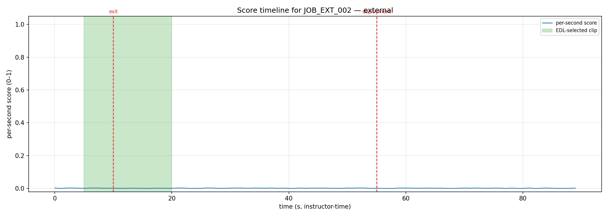
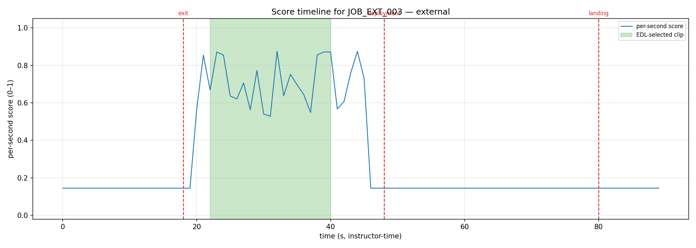

# External-package scoring diagnostic

## Summary statistics

| job_id | package | max | min | mean | std | zeros/total | pattern |
|---|---|---|---|---|---|---|---|
| JOB_EXT_001 | external | 0.01 | 0.00 | 0.01 | 0.003 | 1/90 | near-zero across the timeline |
| JOB_EXT_002 | external | 0.00 | 0.00 | 0.00 | 0.001 | 5/90 | near-zero across the timeline |
| JOB_EXT_003 | external | 0.88 | 0.14 | 0.31 | 0.265 | 0/90 | normal-looking |

## Diagnosis

Across the 3 job(s) examined, the observed pattern is: **near-zero across the timeline (confirms scorer silent fail)**.

Interpretation of the three possible patterns:

- *near-zero across the timeline (confirms scorer silent fail)* — the score line hugs the x-axis for the whole jump, so the scorer never finds a face to reward and the editor has no peaks to cut on. This is the hypothesis under test.
- *coherent but peaking in the wrong place (timeline mismatch)* — the score line has real structure, but its peaks don't line up with the freefall window or the green EDL bands; the numbers are fine but sit on the wrong timeline.
- *normal-looking (different root cause)* — a healthy, peaky timeline whose peaks fall in the expected window; if the edit is still bad, the cause is downstream of scoring.

## Figures

- 
- 
- 
